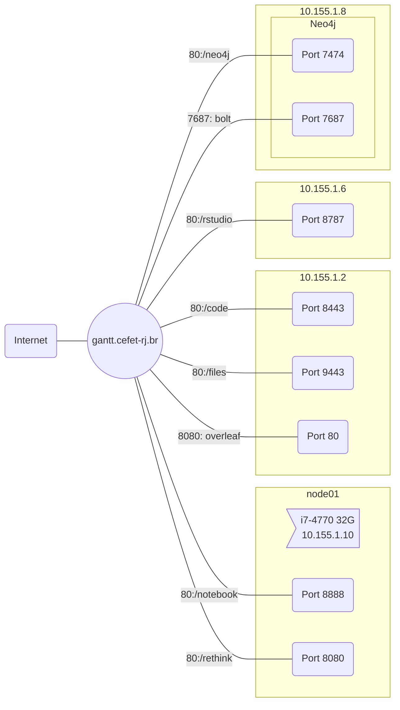
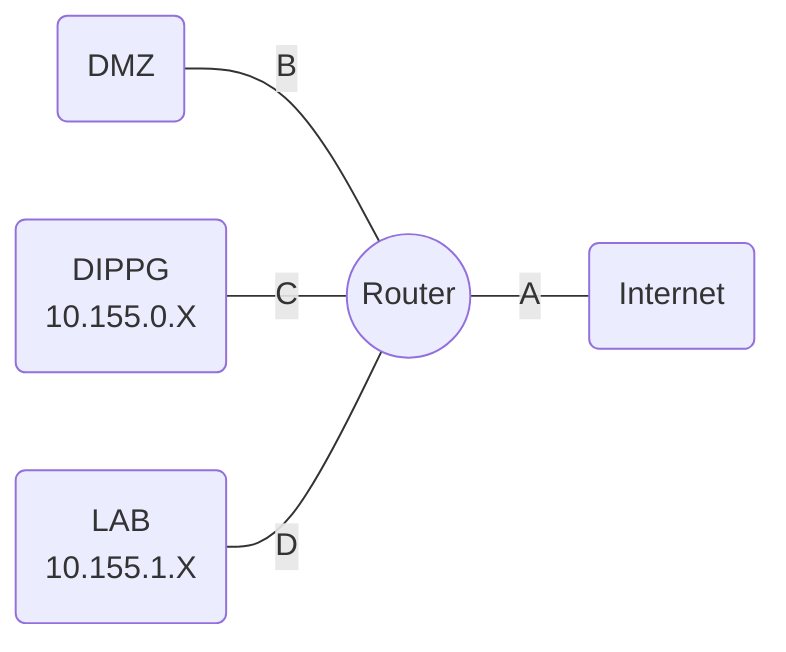

# Cluster LAB 512

## TODO

- [ ] Gantt ports dynamic/private ports and pro, depro, ford, taylor, dreyfus, fayol.


## Services




## Network



### Hosts DMZ

| Host name           |  IP address   |     Mapping |
| ------------------- | :-----------: | ----------: |
| pppro.cefet-rj.br   | 200.9.149.111 |         n.a |
| depro.cefet-rj.br   | 200.9.149.142 |         n.a |
| ford.cefet-rj.br    | 200.9.149.201 | 10.155.1.10 |
| gantt.cefet-rj.br   | 200.9.149.202 | 10.155.1.16 |
| taylor.cefet-rj.br  | 200.9.149.203 |  10.155.1.8 |
| dreyfus.cefet-rj.br | 200.9.149.204 |         n.a |
| fayol.cefet-rj.br   | 200.9.149.205 |         n.a |


### Rules

* A - B
  * ICMP - 3
  * SMTP - TCP - 25, 465, 587
  * MQTT - TCP - 1883
  * HTTP - TCP - 80, 8080, 8081, 8082
  * HTTPS - TCP - 443, 8443
  * SSH/MOSH (TCP=22, UDP=60.000-62.000)
* A - D
  * ICMP - 3
  * SSH/MOSH (TCP=22, UDP=60.000-62.000)
* B - D
  * SSH/MOSH (TCP=22, UDP=60.000-62.000)
* C - D

## Definitions

### TCP and UDP ports

1. System/well-known ports: 0-1023
2. User or registered ports: 1024-49151
3. Dynamic/private ports: 49152-65535

## Password

1. Root - RandomOrg2018;
2. Carvalho - SuperMicroUSA2019;

## Network Configuration

```yaml
network:
    ethernets:
        eno1:
            addresses:
            - 10.155.1.8/24
            dhcp4: false
            gateway4: 10.155.1.1
            nameservers:
                addresses:
                - 10.155.1.16
                search: [moblab.cefet-rj.br]
        eno2:
            addresses:
            - 192.168.0.2/30
            dhcp4: false
    version: 2
```

### Host IP Table

| Name   | IP          | NFS -Iface  | Kind                      | Services         |
| ------ | ----------- | ----------- | ------------------------- | ---------------- |
| Node01 | 10.155.1.10 | 10.155.1.17 | i7-4770 32GB - 6core      | Jupiter, Rethink |
| Node02 | 10.155.1.02 | 10.155.1.17 | i5-3470S 8GB - 4core      | Code, ShareLaTeX |
| Node03 | 10.155.1.03 | 10.155.1.18 | i5-3470S 8GB - 4core      |                  |
| Node06 | 10.155.1.06 | 10.155.1.18 | i7-4770 32GB - 6core      | R Studio         |
| Node07 | 10.155.1.07 | 10.155.1.18 | i7-4770 32GB - 6core      |                  |
| Node08 | 10.155.1.08 | 192.168.0.1 | CPU E5-2630 32GB - 16core | Neo4j, Rethink   |
| Node09 | 10.155.1.09 | 10.155.1.18 | i7-4770 32GB - 6core      |                  |


1. Node01 - 10.155.1.10
2. Node02 - 10.155.1.02
3. Node03 - 10.155.1.03
4. Node06 - 10.155.1.06
5. Node07 - 10.155.1.07
6. Node08 - 10.155.1.08
7. Node09 - 10.155.1.09
8. Printer Samsung M337x 387x 407x Series - 10.155.1.24 

## Docker Images

### Jupyter for Python classes (pass: 123senha)

```bash
docker run -d -p 8888:8888 jupyter/datascience-notebook start-notebook.sh --NotebookApp.password='sha1:95f1d4aef6f9:113751102ab6633ad4a221499a830701307f3421'
```


### Jupyter for LABMOB Group (pass: bebacafe2019aquinocefet)

```bash
docker run -d -v /root/jupyter/internal:/home/jovyan/.jupyter -v /storage/LABMOB/groupdata:/home/jovyan/work -p 8888:8888 jupyter/datascience-notebook start-notebook.sh
```


### Rethink DB

> We need to start both servers to commence operations.

#### Rethink DB - Node08

```bash
docker run -v /root/RethinkDB:/data --restart always -d -p 28015:28015/tcp -p 29015:29015/tcp -p 8080:8080/tcp --name rethink00 rethinkdb rethinkdb --bind all --join 10.155.1.10:29015 --canonical-address 10.155.1.8
```

#### Rethink DB - Node01

```bash
docker run -v /root/RethinkDB:/data --restart always -d -p 28015:28015/tcp -p 29015:29015/tcp -p 8080:8080/tcp --name rethink10 rethinkdb rethinkdb --bind all  --canonical-address 10.155.1.10
```

### Rethink DB - Devel

```bash
docker run --name rethinkdb -p 28015:28015/tcp -p 29015:29015/tcp -p 8080:8080/tcp -v "$PWD:/data" -d rethinkdb
```

### VS Code server

```bash
docker run  -d -p 8443:8443 -v "${PWD}:/home/coder/project" codercom/code-server --allow-http --no-auth -P sofia123
```

```bash
docker run -d -p 8443:8443 -e PASSWORD='bebacafe2019aquinocefet' -v "/storage/LABMOB/groupdata:/home/coder/project" codercom/code-server --allow-http
```


### Moodle

```bash
N.A. yet
```


### Neo4j

```bash
docker run --publish=7474:7474 --publish=7687:7687 --volume=$HOME/neo4j/data:/data --volume=$HOME/neo4j/plugins:/plugins --volume=$HOME/neo4j/config:/var/lib/neo4j/conf   neo4j
```


### Rstudio

``` bash
docker run --rm -p 8787:8787 -v /storage/LABMOB/groupdata:/home/rstudio  -e PASSWORD=bebacafe2019aquinocefet rocker/rstudio
```


### NGINX

```bash
docker run --name some-nginx -p 8080:80 -v /Users/carvalho/tmp/html:/usr/share/nginx/html:ro -v /Users/carvalho/tmp/config:/etc/nginx/conf.d:ro -d nginx
```

> And the configuration should be...


```c
server {
    listen       80;
    server_name  localhost;

    #charset koi8-r;
    #access_log  /var/log/nginx/host.access.log  main;

    location / {
        root   /usr/share/nginx/html;
        index  index.html index.htm;
    }

    location /p/ {
        proxy_set_header Host $host;
        proxy_set_header X-Real-IP $remote_addr;
        proxy_redirect http://$host:$server_port/ http://localhost:8080/p/;

        proxy_pass http://depro.cefet-rj.br/;
    }

    #error_page  404              /404.html;

    # redirect server error pages to the static page /50x.html
    #
    error_page   500 502 503 504  /50x.html;
    location = /50x.html {
        root   /usr/share/nginx/html;
    }

    # proxy the PHP scripts to Apache listening on 127.0.0.1:80
    #
    #location ~ \.php$ {
    #    proxy_pass   http://127.0.0.1;
    #}

    # pass the PHP scripts to FastCGI server listening on 127.0.0.1:9000
    #
    #location ~ \.php$ {
    #    root           html;
    #    fastcgi_pass   127.0.0.1:9000;
    #    fastcgi_index  index.php;
    #    fastcgi_param  SCRIPT_FILENAME  /scripts$fastcgi_script_name;
    #    include        fastcgi_params;
    #}

    # deny access to .htaccess files, if Apache's document root
    # concurs with nginx's one
    #
    #location ~ /\.ht {
    #    deny  all;
    #}
}
```


## Borg

```javascript
r.db('ServiceBorg').table('Microservices')
```


## Moodle

> ```bash
> curl -sSL https://raw.githubusercontent.com/bitnami/bitnami-docker-moodle/master/docker-compose.yml > docker-compose.yml
> 
> docker-compose up -d
> ```


## Tips

> Using environments… Create the environment, then freeze the requirements. After you can add Docker files. 

Follow: https://code.visualstudio.com/docs/python/environments

```bash
python3 -m venv .venv
pip freeze > requirements.txt
```


http://localhost/user/password/set?passwordResetToken=09592d2dab8625e0ef044685354ae212202944b37ecd7a048190262f31bec153